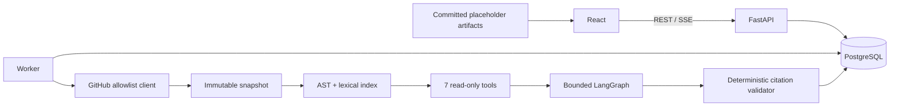
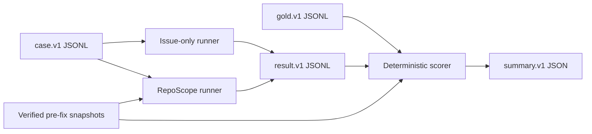

# RepoScope v1 架构

## 系统边界

RepoScope 只调查公开 Python GitHub Bug Issue。公网构建是静态 Demo；本地 live 构建才连接 FastAPI、PostgreSQL、GitHub 与用户自己的 OpenAI-compatible 服务。目标仓库始终是不可信输入，不能被执行、导入、安装或写回。

## 关键组件

### 安全摄取

URL 只允许 `https://github.com/{owner}/{repo}`。客户端固定 API/codeload 主机、禁止重定向，解析公开 Issue 与默认分支 HEAD，并以 40 位 SHA 下载快照。归档层拒绝路径逃逸、符号链接、二进制和超限内容。源码上限为 10 MB，单文件 500 KB。

### 静态索引与检索

- AST：定义、类、函数、导入与静态引用，适合精确结构定位；
- 关键词：处理语法错误、不完整文件、错误文本和字符串；
- 向量接口：为语义召回保留代码块元数据，但不会取代确定性引用校验。

这不是普通 RAG：Agent 会根据调查状态选择工具、追踪预算、批判证据、修订一次，并让最终引用回到固定快照逐字校验。

### Agent 与证据

Agent 只能获得七个只读工具，不拥有 Shell、写文件、执行测试、安装依赖或任意网络工具。每次最多 12 次工具调用、两轮证据补查、两次模型重试和一次用户修订。主假设若没有至少一条有效证据，报告降级为 `insufficient_evidence`。

### 持久任务与 SSE

API 把分析写入数据库；worker 通过租约领取，LangGraph checkpoint 保存调查状态。事件用单调序号持久化后经 SSE 回放，因此断线重连、页面刷新和 worker 重启不会要求客户端猜测已完成步骤。报告与 `REVIEW_READY` 状态原子发布。

未配置模型 Key 时，worker 使用安全降级服务：不构造模型客户端、不领取持久任务，但继续运行快照 janitor。任务保持排队；配置 Key 并重建 worker 后可恢复处理。这样空配置可以验证 Compose、迁移和静态界面，又不会产生隐式模型调用。

### 临时数据生命周期

生产快照必须保留到接受或一次修订完成，不能分析结束即删。终态且超过 24 小时的专用子目录由 janitor 清理；活跃分析路径、符号链接、根目录和越界路径不会删除。评测 runner 只操作自己创建的临时副本，并在成功、异常或取消时清理，不删除外部冻结快照。

## 可观测性

API 与 worker 是不同进程，因此 v1 不提供容易误导的进程内 `/metrics`。关键运行观察以 JSON 日志事件输出：service、event、analysis/case ID、安全状态/错误码、单调时长、工具/模型/引用计数和清理数量。严格 allowlist 禁止 Issue 正文、prompt、excerpt、异常原文、凭据和本地快照路径进入日志。

## 评测架构

Gold 与 case 物理分离。Runner 不读取修复 PR、diff、fix commit 内容、修复后源码或 gold。Scorer 复用生产引用校验器计算引用有效性。Task 7 内置的是无网络 scripted adapter；没有真实模型成绩。

## 主要取舍

- 固定 commit 而非跟随默认分支：保证引用和实验可复现；
- 只读静态调查而非自动修复：缩小供应链与执行风险；
- PostgreSQL checkpoint + SSE 而非内存任务：支持恢复与可观察进度；
- 公网预生成 Demo 而非开放模型接口：避免陌生人消耗密钥并保持零默认模型成本；
- 历史 PR 只作为 evaluator 的答案来源：真实修复文件可提供客观参照，但绝不能成为 Agent 输入；
- 确定性指标与人工误差分析结合：不能只用 LLM-as-judge，因为评委会漂移，也可能偏好更流畅但无证据的答案。
